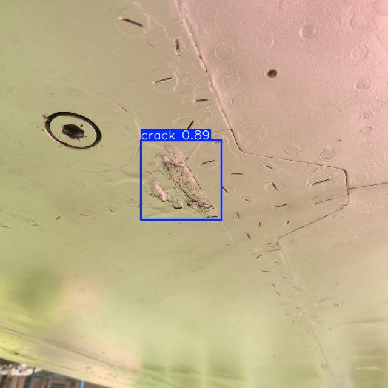

# Aircraft Surface Crack Detection using YOLOv8



This project presents an automated crack detection system for aircraft fuselage surfaces using deep learning–based computer vision. A custom dataset of real aircraft surface images was used to train YOLOv8 models, achieving high accuracy in detecting structural cracks.

## Features
* Custom dataset of aircraft fuselage defects
* YOLOv8n (baseline) and YOLOv8s (improved) models
* High‑accuracy crack detection
* Real‑time inference capability
* Clean and reproducible training pipeline
* Lightweight Python scripts for training and inference

## Project Structure
* data/
  * aircraft_fuselage.yaml
* models/
  * yolov8n_results.txt
  * yolov8s_results.txt
  * readme.md
* results/
  * yolov8n/
  * yolov8s/
  * sample_predictions/
* src/
  * train.py
  * predict.py
  * utils.py
* requirements.txt
* README.md

## Motivation & Problem Definition

Aircraft fuselage surfaces are exposed to harsh environmental conditions such as pressure cycles, temperature variations, and mechanical stress. Over time, these factors can lead to the formation of structural cracks. Early detection of such cracks is critical for flight safety, maintenance planning, and preventing costly failures.

Traditional inspection methods rely heavily on manual visual inspection, which is:

- Time‑consuming  
- Prone to human error  
- Difficult to scale  
- Dependent on inspector experience  

This project aims to automate the crack detection process using a deep learning–based computer vision system. By leveraging YOLOv8, the goal is to provide a fast, accurate, and reliable tool that assists maintenance teams in identifying potential structural defects before they become critical.

## Technical Overview

This project uses the YOLOv8 object detection architecture to identify structural cracks on aircraft fuselage surfaces. The workflow consists of four main components:

### **1. Dataset**
A custom dataset of aircraft fuselage images was prepared, containing manually annotated crack regions.  
The dataset follows the YOLO format:

- `images/` — training and validation images  
- `labels/` — corresponding `.txt` annotation files  
- `aircraft_fuselage.yaml` — dataset configuration  

### **2. Model Architecture**
Two YOLOv8 variants were trained:

- **YOLOv8n** — lightweight baseline model  
- **YOLOv8s** — improved model with higher accuracy  

Both models use:

- CSPDarknet backbone  
- PAN-FPN neck  
- Decoupled detection head  

### **3. Training Pipeline**
Training was performed using:

- Image size: 640×640  
- Epochs: 50  
- Optimizer: SGD  
- Data augmentations:  
  - Horizontal flip  
  - Random brightness/contrast  
  - Mosaic augmentation  

### **4. Evaluation**
Models were evaluated using:

- Precision  
- Recall  
- mAP50  
- mAP50–95  

YOLOv8s achieved the best performance and is used as the final model.
## Project Highlights

- Achieved **high‑accuracy crack detection** on real aircraft fuselage images  
- YOLOv8s model reached **0.752 mAP50** and **0.883 precision**, outperforming the baseline  
- Fully reproducible training pipeline with clean dataset structure  
- Lightweight inference script enables **real‑time crack detection**  
- Includes sample predictions, evaluation metrics, and downloadable pretrained weights  
- Designed as a practical tool to support aircraft maintenance and safety inspections

## Model Performance
| Metric | YOLOv8n | YOLOv8s |
| --- | --- | --- |
| Precision | 0.714 | **0.883** |
| Recall | 0.622 | **0.662** |
| mAP50 | 0.651 | **0.752** |
| mAP50‑95 | 0.329 | **0.390** |

## Sample Predictions
Sample inference results can be found in:
results/sample_predictions/

## Training
yolo detect train model=yolov8s.pt data=data/aircraft_fuselage.yaml epochs=50 imgsz=640

## Inference
yolo detect predict model=models/yolov8s_best.pt source=path/to/images
Or using the included script:
python src/predict.py

## Download Model Weights
Model weights are stored externally due to size limitations.
* YOLOv8n best.pt → https://drive.google.com/file/d/1U-8TitQ87gfdj_KdGLtbc7FlAx7xiVx6/view?usp=drive_link
* YOLOv8s best.pt → https://drive.google.com/file/d/1AoC5-OB08-VVN4kDlpItg_820B_YeulF/view?usp=drive_link

## Requirements
ultralytics
opencv-python
numpy

## 🛠 How to Use

Follow the steps below to run training or inference using this project.

### **1. Clone the repository**
```bash
git clone https://github.com/<your-username>/<your-repo>.git
cd <your-repo>
pip install -r requirements.txt
python src/predict.py

This will generate predictions inside:
results/sample_predictions/

If you want to retrain the model:
python src/train.py

Training outputs will be saved under:
runs/detect/

Download the pretrained YOLOv8s model from the links below and place it inside:
models/

You can then run inference using:
yolo detect predict model=models/yolov8s_best.pt source=path/to/images
```

## License
MIT License
